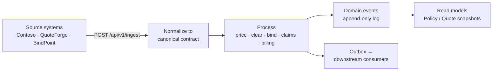
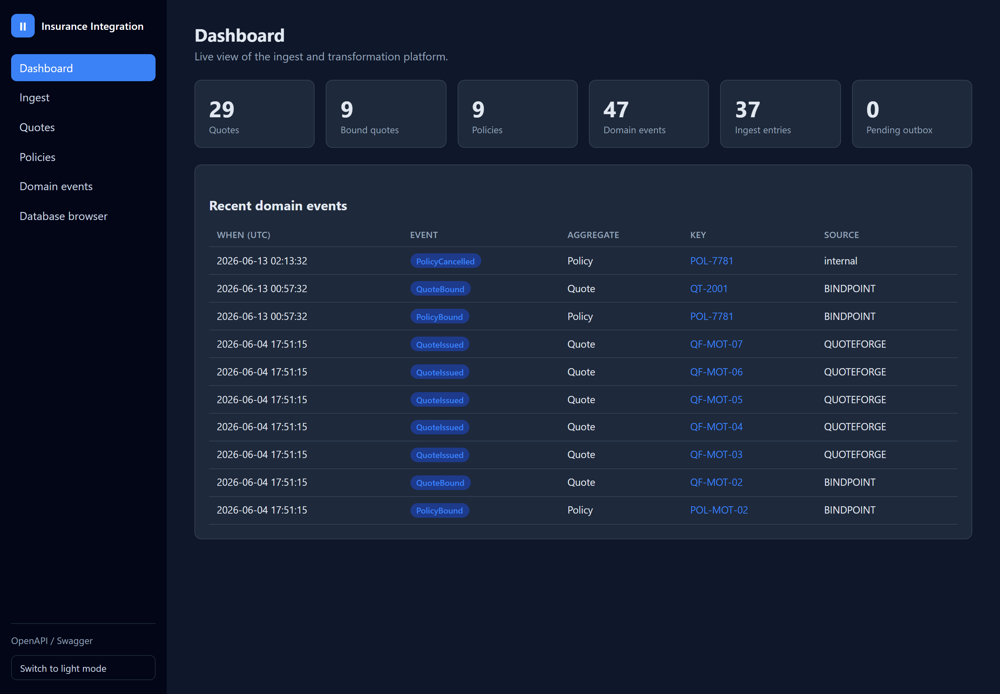
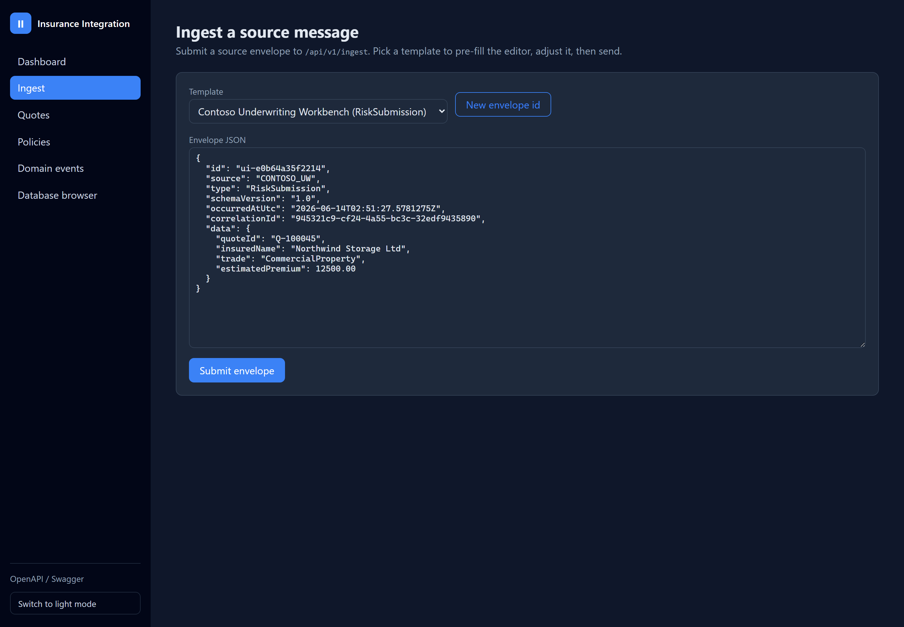
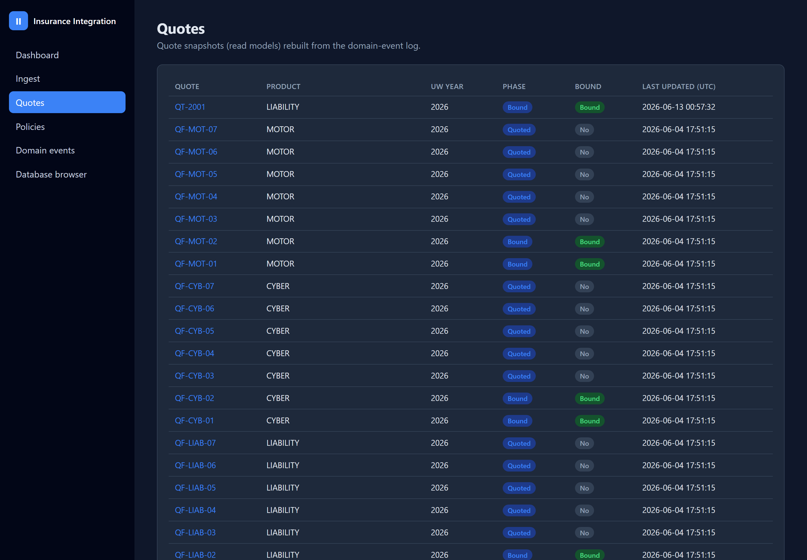
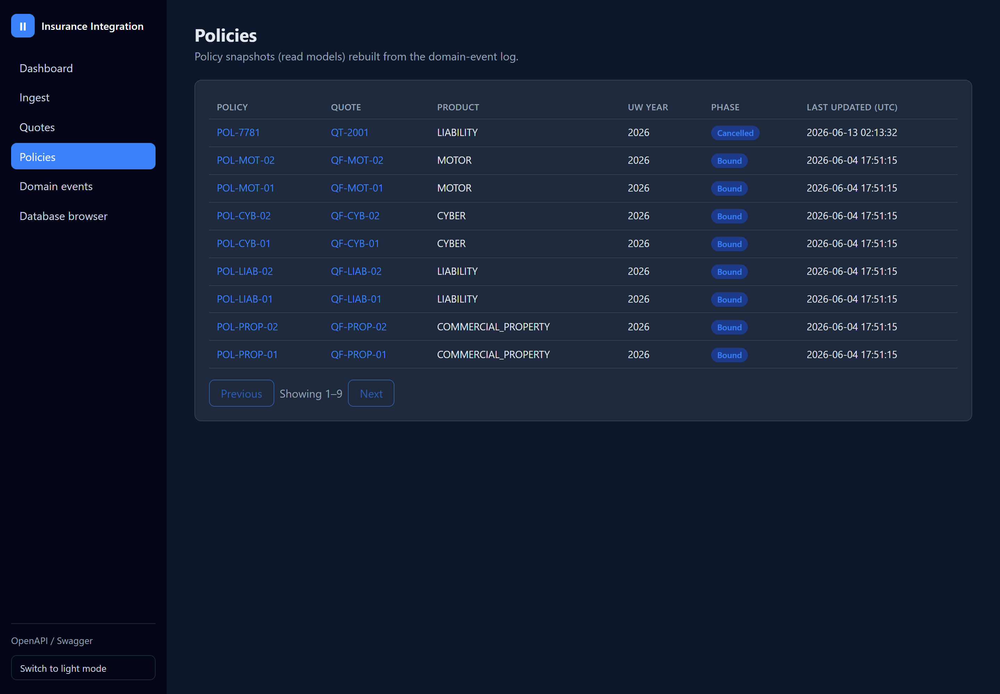
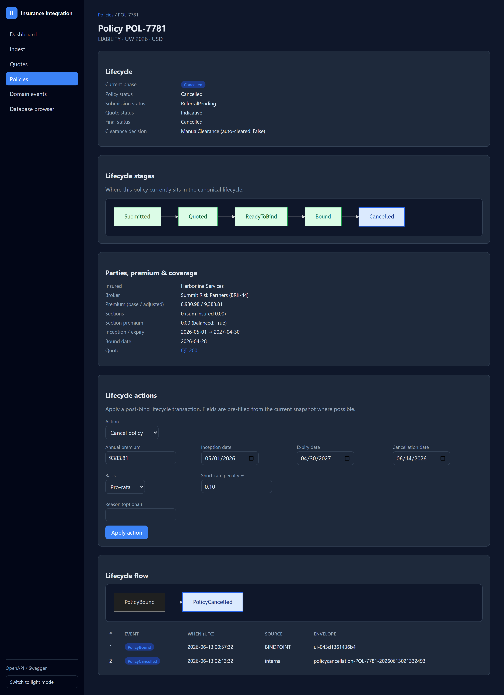
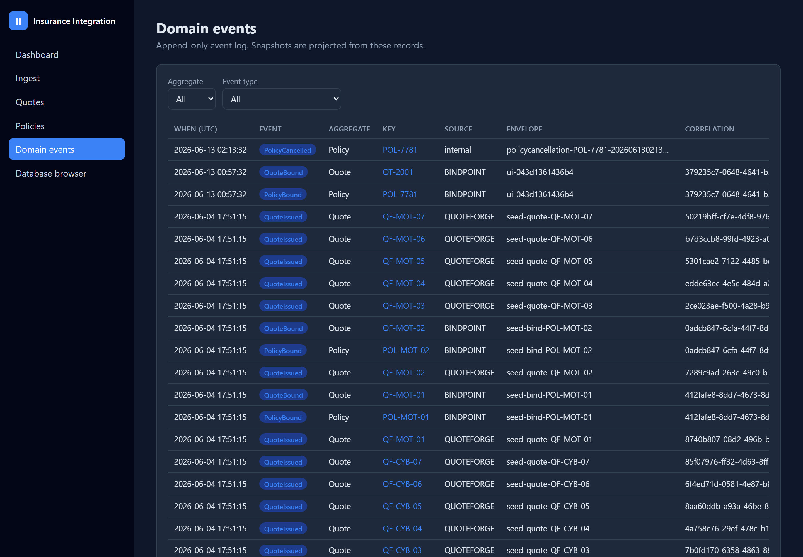
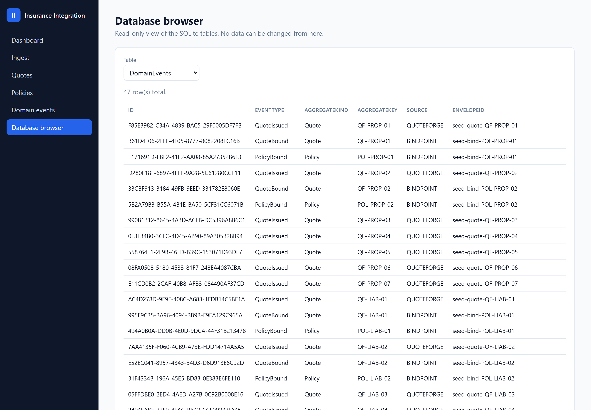

# Insurance Integration Platform

> **Primarily a QA testing ground.** A realistic, fully-owned insurance back office - REST API,
> Blazor web UI, event-sourced core, and seeded sample data - built to be exercised by automated and
> manual tests, so QA has a non-trivial system under test instead of another to-do app.

> Functionally it takes messy, source-specific insurance messages from many systems, turns them into
> one clean internal format, runs the real insurance lifecycle on them (quote → bind → policy →
> claims → billing), and hands clean results to downstream systems - with a built-in web UI to watch
> it all happen.

> **Built AI-assisted, human-directed.** Planned, generated, reviewed, and tested with
> AI tooling under my direction - the architecture, code review, and final decisions are mine.

## What is this, in plain language?

Insurers, brokers, and MGAs run dozens of systems that all describe the same things - a quote, a
policy, a claim - in their own slightly different shapes. Wiring every system directly to every other
system is where integration projects go to die.

This project is the **translation-and-processing layer in the middle**. Think of it as a universal
adapter for insurance data:

1. **Ingest** - a source system POSTs a message in its own shape (e.g. Contoso Underwriting,
   QuoteForge, BindPoint).
2. **Normalize** - the message is mapped into one **canonical** contract the platform owns, so the
   rest of the system never has to care where it came from.
3. **Process** - lifecycle-aware logic runs the real insurance work: pricing, clearance / duplicate
   detection, bind rules, endorsements, renewals, cancellations, claims, and billing.
4. **Emit & record** - every change becomes a **domain event** (an append-only history) plus an
   up-to-date **read model**, and outbound messages go to downstream consumers.



**Who is it for?** QA / SDET engineers who want a realistic, fully-owned system under test - a REST
API, a Blazor UI, deterministic seeded data, and a read-only DB browser to assert against - and
engineers evaluating a clean, testable way to build an insurance integration layer, with
modular-monolith and event-sourced-style patterns applied to a real domain rather than a to-do app.

**What makes it interesting?**

- A strict, enforced separation between *source* shapes, *canonical* contracts, and *outbound*
  responses.
- Event-sourced-style history: every state change is a replayable domain event, and read models can
  be rebuilt from scratch.
- A real insurance lifecycle, not a CRUD demo - bind preconditions, endorsements, renewals with
  loss-ratio pricing, claims transitions, installment billing and delinquency.
- A built-in **Blazor Server UI** (no separate JS build) to ingest messages, browse snapshots, and
  watch the event flow as live diagrams.
- Built on **.NET 10**, EF Core + SQLite, with a full NUnit 4 test suite (**360 tests**).
- **Built to be tested**: deterministic seeded data, a read-only `/database` browser for state
  assertions, Swagger + a ready-to-import Postman collection, and idempotent ingest make it a
  realistic system under test for API and UI automation.

## Run it locally

```powershell
# from the repo root
dotnet run --project .\src\InsuranceIntegration.Api
```

Then open **<http://localhost:5000>** for the web UI, or **<http://localhost:5000/swagger>** for the
API. On first run in `Development` the database is seeded with sample quotes and policies across every
product family, so the UI has data to show immediately. For the full configuration and per-endpoint
guide see [docs/guides/USAGE.md](docs/guides/USAGE.md).

Helper scripts (and matching **VS Code tasks** "Start app" / "Stop app", `Ctrl+Shift+P → Run Task`)
wrap the same commands:

```powershell
.\scripts\start.ps1          # run the app (add -Watch for hot reload)
.\scripts\stop.ps1           # stop it and free port 5000
```

## Visual tour

A walkthrough of the built-in web UI running against the seeded sample data. Every screenshot is
captured from the live app at `http://localhost:5000`.

### Dashboard



The landing page (`/`) summarises the whole system at a glance: how many quotes, bound quotes, and
policies exist, how many domain events and ingest entries have been recorded, and how many outbox
messages are still pending - followed by a live feed of the most recent domain events.

### Ingest a source message



The `/ingest` page lets you POST a source envelope without leaving the browser. Pick a source-system
template (here, Contoso Underwriting Workbench) to pre-fill the editor with a valid message, tweak
the JSON, and submit - the same path a real upstream system would take.

### Quotes



The `/quotes` page lists `QuoteSnapshot` read models across every product family (Property,
Liability, Cyber, Motor) with colour-coded lifecycle-phase and bound/unbound badges. Each row links
to a detail page with the quote's lifecycle diagrams.

### Policies



The `/policies` page shows `PolicySnapshot` read models - the policies bound from the quotes above -
each linking back to its originating quote and through to a full lifecycle view.

### Policy detail - lifecycle and actions



The policy detail page is the centrepiece. It shows where the policy sits on the canonical lifecycle,
renders a **Mermaid diagram** built from the policy's own event stream, and exposes a **lifecycle
actions** panel - cancel, endorse, renew, reinstate, lapse, or non-renew - driven straight from the
UI with fields pre-filled from the snapshot.

### Domain events



The `/events` page is a filterable view of the append-only domain-event log that backs every
snapshot. Each aggregate links to a detail page that renders its lifecycle as a Mermaid flow diagram.

### Database browser



The `/database` page is a read-only browser over the underlying SQLite tables (here, `DomainEvents`),
so you can inspect exactly what the platform persisted - the inbox, the event log, and the snapshot
read models - without a separate database tool.

## Project goal

This repository is primarily a **QA testing ground**: a realistic insurance ingest and transformation platform (modular monolith) that exists to be exercised by automated and manual tests, and is being grown into a deployable product with a Blazor UI. The platform receives source-specific insurance messages, normalizes them into platform-owned canonical contracts, executes lifecycle-aware processing logic, and emits final outbound messages for downstream consumers.

## Architectural direction

- **Platform**: ASP.NET Core Web API + **Blazor Server UI** (same host)
- **Runtime**: .NET 10 LTS
- **Design**: SOLID, OOP, composition over inheritance, thin endpoints, orchestration through application flow services
- **Model separation**: source contracts, canonical contracts, and final outbound messages are explicitly separated
- **Architecture style**: modular monolith first, plugin-ready later
- **Code organization**: one class per file, namespaces aligned to folders, business logic isolated for future unit testing

## Target product direction

The platform is intended to grow into a multi-source SaaS insurance integration layer for insurers, MGAs, brokers, and ecosystem partners supporting:

- submissions
- quotes
- policies
- clearance
- claims
- billing and installments
- endorsements
- renewals
- cancellations
- reinstatements

## Current structure

```text
src/InsuranceIntegration.Api/
  Program.cs
  Configuration/
  Components/         # Blazor Server UI (App/Routes/_Imports, Layout, Pages, Shared/EventFlow)
  wwwroot/           # UI static assets (app.css, js/app.js for Mermaid interop)
  Endpoints/
  SourceContracts/
  CanonicalContracts/
  Responses/
  Snapshots/        # PolicySnapshot, QuoteSnapshot read-models
  Events/           # DomainEvent type / aggregate-kind constants, RiskEventPayload
  Mappers/
  Services/
    Catalog/
    Clearance/
    Events/         # IDomainEventLog + DomainEventLog
    Flows/          # RiskFlowService, ClaimFlowService, BindPreconditionService
    Ingest/         # dispatcher, idempotency, per-handler logic
    Matching/       # Levenshtein calculator (used only by clearance)
    Orchestration/  # RiskSubmissionOrchestrator (flow + relational upserts + outbox + snapshot routing)
    Outbox/
    Policies/       # PolicyAdjustmentService, PolicyLifecycleService, PolicyRenewalService
    Pricing/
    Products/
    Schemas/
    Snapshots/      # projectors, EF-backed snapshot services, RiskSnapshotRouter, SnapshotRebuildService
    Ui/             # IUiGateway facade + EventFlowDiagram (Mermaid) for the Blazor UI
  Persistence/      # IntegrationDbContext + entity types (snapshots, DomainEventEntity, Submission/Quote/Policy relational write model, RowVersionInterceptor)
  Migrations/
  Middleware/       # CorrelationIdMiddleware
  ReferenceData/
```

### Current module responsibilities

- **SourceContracts**
  - Source-facing DTOs such as the generic ingest envelope and invented Contoso risk payload.
- **CanonicalContracts**
  - Platform-owned normalized insurance contracts for internal processing.
- **Responses**
  - Outbound processed response models returned to callers (e.g. `IngestReceipt`, `FinalRiskResponse`).
- **Snapshots**
  - Consolidated read-model documents (`PolicySnapshot`, `QuoteSnapshot`) keyed by business reference. Updated by `Services/Snapshots/*` projectors after each Risk-domain ingest so multiple events from different sources merge into one growing JSON document per policy/quote.
- **Mappers**
  - Source-specific mapping into canonical contracts.
- **Services**
  - Catalog lookup, matching, flow orchestration, and schema generation.
- **ReferenceData**
  - Reserved for future static lookups and shared business reference assets.

## Current endpoints

Ingest and discovery:

- `GET /health`
- `GET /api/v1/source-systems`
- `GET /api/v1/products` and `GET /api/v1/products/{productCode}/rating`
- `POST /api/v1/ingest` and `GET /api/v1/ingest/{source}/{envelopeId}` (per-envelope receipt + replay)
- `POST /api/v1/ingest/risks` (source-shape risk ingest)
- `POST /api/v1/risks` (canonical risk submission)

Snapshot reads:

- `GET /api/v1/policies` and `GET /api/v1/policies/{policyReference}` (consolidated `PolicySnapshot` per policy key)
- `GET /api/v1/policies/{policyReference}/schedule.pdf` - rendered policy-schedule PDF (QuestPDF) built from the snapshot
- `GET /api/v1/quotes` and `GET /api/v1/quotes/{quoteReference}` (consolidated `QuoteSnapshot` per quote key)

Lifecycle writes (snapshot mutation + DomainEvent in one EF transaction):

- `POST /api/v1/policies/cancellations`
- `POST /api/v1/policies/endorsements`
- `POST /api/v1/policies/renewals`
- `POST /api/v1/policies/reinstatements` (restore a cancelled policy; `PolicyReinstated` event)
- `POST /api/v1/policies/lapses` (lapse an in-force policy for non-payment; `PolicyLapsed` event)
- `POST /api/v1/policies/non-renewals` (mark an in-force policy not-renewed at expiry; `PolicyNonRenewed` event)

Billing:

- `POST /api/v1/billing/payments` (apply a payment to an installment schedule; settles installments `Issued → Paid` in due order and recomputes the billing position)
- `POST /api/v1/billing/delinquency` (flag open installments past due - with optional grace period - as `Overdue` and recompute dunning / cancellation-for-non-payment recommendation)

Claims:

- `POST /api/v1/claims/transitions` (validate a claim status move `Notified → Open → Reserved → Settled/Declined → Closed`; returns the resulting status and matching `Claim*` event type)
- `POST /api/v1/claims/financials` (set/adjust the case reserve or record an indemnity / expense payment; recomputes `incurred = paid + outstanding reserve`)

Replay / sanity:

- `POST /api/v1/snapshots/policies/{policyReference}/rebuild` and `POST /api/v1/snapshots/quotes/{quoteReference}/rebuild` - replay the aggregate's `DomainEvents` through the projector

Schemas:

- `GET /api/v1/schemas/ingest/envelope`
- `GET /api/v1/schemas/ingest/risk-request`
- `GET /api/v1/schemas/canonical/risk-request`
- `GET /api/v1/schemas/final/risk-response`

For request / response shapes and examples per endpoint see [docs/guides/USAGE.md §7](docs/guides/USAGE.md). Swagger UI is exposed at `/swagger` in `Development`.

## Web UI (Blazor Server)

An interactive Blazor Server UI is hosted inside the same API process (single host, no separate JS
toolchain). Browse to the application root (`/`) when it is running. Pages:

- **Dashboard** (`/`) - counts (quotes, bound quotes, policies, domain events, ingest entries,
  pending outbox) and a recent-events feed.
- **Ingest** (`/ingest`) - submit a source envelope to `POST /api/v1/ingest`, with templates
  pre-filled from the source-system catalog.
- **Quotes / Policies** (`/quotes`, `/policies`) - paged list + detail views over the
  `QuoteSnapshot` / `PolicySnapshot` read-models. Each detail page shows a **lifecycle stage**
  diagram (canonical phases with the current stage highlighted) so you can see where the risk
  sits, plus a **lifecycle flow** diagram built from its event stream. The policy detail page also
  has a **lifecycle actions** panel - cancel, endorse, renew, reinstate, lapse, or non-renew the
  policy directly from the UI (fields pre-filled from the snapshot), which previously required
  Swagger.
- **Domain events** (`/events`) - filterable event log; each aggregate detail page renders a
  **Mermaid lifecycle flow diagram** built from its event stream.
- **Database browser** (`/database`) - read-only view of the SQLite tables.

In `Development`, the database is populated on first run with sample quotes and policies across
every product (risk) family (Property, Liability, Cyber, Motor) by
`Services/Seeding/DevelopmentDataSeeder`. It is a no-op once any quote snapshot exists; delete
`integration.db` to reseed.

The UI talks to the existing services through an `IUiGateway` facade (`Services/Ui/`) that opens a
fresh DI scope per call, so it never holds a long-lived circuit-scoped `DbContext`. The database
browser is **read-only**. When API-key enforcement is enabled (see below), the browser and all
write endpoints require an `X-Api-Key` header.

### API-key protection

Mutating endpoints (`POST`/`PUT`/`PATCH`/`DELETE`) and the `/database` browser can be gated behind
an API key. Enforcement is **disabled by default** so local development and tests run without
credentials; it turns on automatically once one or more keys are configured under the `ApiKey`
section:

```powershell
$env:ApiKey__Keys__0 = "my-secret-key"
dotnet run --project .\src\InsuranceIntegration.Api\InsuranceIntegration.Api.csproj
```

Clients then send the key on protected requests:

```
X-Api-Key: my-secret-key
```

GET reads, `/health`, `/swagger`, the OpenAPI document, and static assets are never gated. The
header name (`X-Api-Key` by default) and whether the DB browser is protected are configurable via
`ApiKey:HeaderName` and `ApiKey:ProtectDatabaseBrowser`.

### Outbox transport

Domain events captured in the transactional outbox are delivered by the `OutboxDispatcher`
background worker, whose transport is configurable via the `Outbox` section:

- `Logging` (default) - writes a dispatch line per event; no external infrastructure required.
- `File` - appends each event as a JSON line to `Outbox:FilePath` (`outbox-events.jsonl` by default).
- `Webhook` - POSTs each event as JSON to `Outbox:WebhookUrl`.

```powershell
$env:Outbox__Transport = "File"
$env:Outbox__FilePath = "events.jsonl"
```

A failed delivery (non-success webhook response or file-write error) leaves the message pending so
the dispatcher retries it on a later poll; unknown or blank transport values fall back to `Logging`.
Message-broker adapters (RabbitMQ / Azure Service Bus) can be added as further `IOutboxPublisher`
implementations.

## JSON schema support

The API exposes machine-readable JSON schema documents for the main vertical slice contracts:

- `GET /api/v1/schemas/ingest/risk-request`
- `GET /api/v1/schemas/canonical/risk-request`
- `GET /api/v1/schemas/final/risk-response`

These exist so client integrators, internal tooling, future contract validation middleware, and automated onboarding workflows can inspect the platform contracts without coupling themselves to source-specific examples.

## Example canonical request

This example intentionally uses a neutral canonical contract, not a source-specific payload:

```json
{
  "entityId": "e6f3c24a-a61a-4b3b-9f1b-58d08ef6da52",
  "externalReference": "EXT-2026-0001",
  "productCode": "COMMERCIAL_PROPERTY",
  "sourceSystem": "BROKER_PORTAL",
  "transactionType": "Submission",
  "schemeCode": "STANDARD",
  "transactionTimestampUtc": "2026-04-24T03:00:00Z",
  "annualizedGrossPremium": 15000.00,
  "currencyCode": "USD",
  "underwriterName": "Platform Intake",
  "paymentMethod": "Invoice",
  "submission": {
    "underwritingYear": 2026,
    "channelCode": "Digital",
    "brokerPremium": 14850.00,
    "technicalPremium": 14500.00,
    "revenue": 2200000.00,
    "isRenewal": false
  },
  "broker": {
    "brokerCode": "BRK-100",
    "brokerName": "Summit Risk Partners",
    "hasDelegatedAuthority": false,
    "isPreferredPartner": true
  },
  "insured": {
    "fullName": "Northwind Storage Ltd",
    "tradingName": "Northwind Storage",
    "segmentCode": "SME",
    "annualRevenue": 2200000.00,
    "employeeCount": 40,
    "yearsInBusiness": 8
  },
  "quote": {
    "quoteReference": "QT-2001",
    "effectiveDate": "2026-05-01",
    "expiryDate": "2027-04-30",
    "quoteStatusHint": "Indicative"
  },
  "policy": {},
  "clearance": {
    "autoClearanceEnabled": true,
    "premiumThreshold": 25000.00,
    "fuzzyMatchTolerance": 3
  },
  "enrichments": [
    {
      "family": "Universal",
      "code": "TRIAGE_STANDARD",
      "description": "Universal triage baseline",
      "multiplier": 1.02,
      "isBlocking": false,
      "isDerived": false
    }
  ],
  "contractChecks": [
    {
      "code": "CONTRACT_SIGNALS",
      "isComplete": true,
      "description": "Core contract indicators present"
    }
  ],
  "complianceChecks": [
    {
      "code": "KYC_BASELINE",
      "isComplete": true,
      "description": "Baseline compliance record complete"
    }
  ],
  "parties": [
    {
      "role": "Insured",
      "name": "Northwind Storage Ltd"
    }
  ],
  "claims": [
    {
      "claimReference": "CLM-100",
      "claimantName": "Northwind Storage Ltd",
      "incurredAmount": 1200.00,
      "reservedAmount": 300.00
    }
  ],
  "sections": [
    {
      "sectionCode": "PROP",
      "sectionName": "Property Damage",
      "subcovers": [
        {
          "subcoverCode": "FIRE",
          "subcoverName": "Fire"
        }
      ]
    }
  ],
  "sectionOperations": [
    {
      "sectionCode": "PROP",
      "operationType": "AddSection",
      "subcoverCode": null,
      "removeAllSubcovers": false
    }
  ],
  "installments": [
    {
      "sequenceNumber": 1,
      "dueDate": "2026-06-01",
      "amount": 7500.00,
      "isPaid": false
    }
  ]
}
```

## Remaster direction

- **Inbound source-specific contracts** stay isolated from canonical processing contracts.
- **Canonical internal contracts** remain platform-owned and neutral.
- **Final outbound messages** remain separate from source and canonical DTOs.
- **Flow-specific logic** is organized by lifecycle area and can be expanded into claims, billing, clearance, policy, and endorsement slices.
- **Future pluginization** should be possible because boundaries already separate mapping, orchestration, matching, schema generation, and flow logic.

## Architecture: three storage tiers

Each business state change flows through three persistence tiers, each with a different read pattern and replay scope:

| Tier | Table | Key read pattern | Replay scope |
|---|---|---|---|
| Inbox (raw envelopes) | `IngestEntries` | per-envelope receipt; idempotency keyed on `(Source, EnvelopeId)` | full pipeline rebuild from source |
| Event log (canonical) | `DomainEvents` | per-aggregate timeline; cross-aggregate queries | rebuild any snapshot from its events |
| Aggregate state | `PolicySnapshots`, `QuoteSnapshots` | one-row read of the latest state | n/a (this *is* the rebuilt state) |

Domain events are written in the same EF transaction as the snapshot mutation, so the two layers can never disagree. `POST /api/v1/snapshots/policies/{ref}/rebuild` reads every event for an aggregate and runs them through the projector to verify (or recover) the live snapshot. See [docs/guides/USAGE.md §6 "Domain events"](docs/guides/USAGE.md) for the full schema and replay semantics.

## Current implemented vertical slice

The current implementation delivers a coherent end-to-end policy lifecycle:

- generic source ingest envelope with idempotency cache
- three risk mappers (`CONTOSO_UW`/`RiskSubmission`, `QUOTEFORGE`/`QuoteRequest`, `BINDPOINT`/`PolicyBindRequest`)
- canonical risk processing flow (enrichments, premium, claim aggregation, matching, clearance, section-action logic)
- per-business-key consolidated `PolicySnapshot` and `QuoteSnapshot` documents
- domain event log with replay-capable payloads (`RiskEventPayload { canonicalRequest, finalResponse }`)
- post-bind lifecycle: `cancel`, `endorse`, `renew` - each mutating the snapshot AND writing a `Policy*` event
- quote versioning with `Version` / `IssuedAtUtc` / `ValidUntilUtc` / `ValidityDays`
- bind preconditions (no missing quote, not expired, not already bound, status in `{Quoted, Indicative}`); rejection surfaces `BindRejectionReason` and finalStatus `BindRejected`
- renewal flow with loss-ratio + exposure-delta + override-load pricing model and prior-policy lineage on the renewal `QuoteSnapshot`
- snapshot rebuild endpoints to replay events through the projector
- catalog, schema, and rating endpoints

## Build

```powershell
dotnet build .\InsuranceIntegration.sln
```

## Testing

Testing is the point of this project - the app is a realistic system under test, not just a demo to read.

```powershell
dotnet test .\InsuranceIntegration.sln
```

Tests are organized into **two tiers**. The **dev tier** (`tests/dev/`) is white-box **360 NUnit 4 tests**, all green and running in a few seconds with no external dependencies: unit plus service- and persistence-level integration on in-memory SQLite (`InsuranceIntegration.Api.Tests`), and - added 2026-06-15 - **HTTP-endpoint integration tests** (the API hosted in-process with `WebApplicationFactory`) plus **Blazor-UI component tests** (bUnit) in `InsuranceIntegration.Api.IntegrationTests`. The **QA tier** (`tests/qa/`) is black-box **Playwright** (TypeScript) against the running app - real HTTP API checks, UI flows across Chromium/Firefox/WebKit, and accessibility (axe) assertions. Coverage spans the service, flow, mapper, snapshot, outbox, and security layers, the HTTP API surface (including correlation-id echo and multi-source ingest routing), and all seven Blazor UI pages. For both tiers' stack, conventions, patterns, the two-tier coverage map, and manual end-to-end recipes see [docs/guides/TESTING.md](docs/guides/TESTING.md).

## Documentation

All project docs live under **[docs/](docs/README.md)** - see that index for the full map. Organized by purpose:

**Guides** (`docs/guides/`)

- [docs/guides/USAGE.md](docs/guides/USAGE.md) - build, run, configuration, and per-endpoint request/response examples.
- [docs/guides/TESTING.md](docs/guides/TESTING.md) - running the test suite, conventions, and manual end-to-end recipes.
- [docs/guides/DEPLOYMENT.md](docs/guides/DEPLOYMENT.md) - Docker image build and VPS deployment guide.

**Reference** (`docs/reference/`)

- [docs/reference/API_EXAMPLES.md](docs/reference/API_EXAMPLES.md) - manual-testing pack: mandatory fields, business rules, and per-scenario JSON payloads under `docs/reference/examples/`.
- [docs/reference/postman/](docs/reference/postman) - curated Postman collection + environment ready to import (see `docs/reference/API_EXAMPLES.md` §9).

**Project** (`docs/project/`)

- [docs/project/KNOWN_ISSUES.md](docs/project/KNOWN_ISSUES.md) - documented, intentionally-unfixed issues.
- [docs/project/FEATURE_PLAN.html](docs/project/FEATURE_PLAN.html) - candidate-feature backlog with add/defer/skip verdicts (open in a browser).
